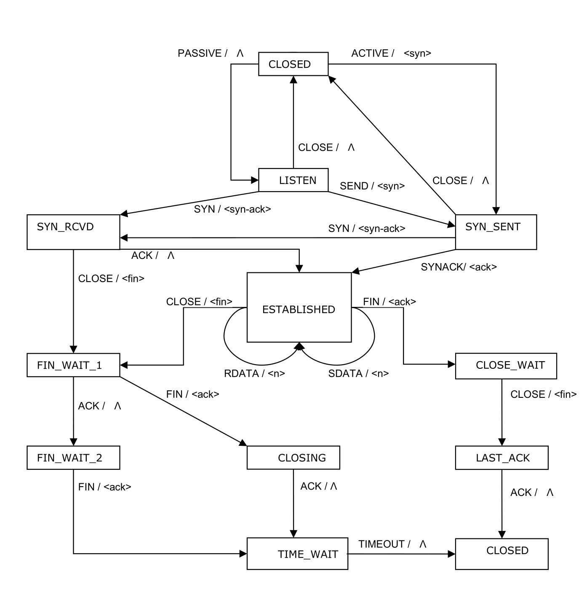

# CSCI-GA 2662: Data Comms & Networks - Lab 6 - TCP Finite State Machine

This is a TCP Finite State Machine simulator implemented in C++. It receives a series of EVENTS from stdin and reports the transitions for the FSM if they are valid.



## Installation

### Prerequisites

- `make` and a valid C++ compiler. The `Makefile` specifies g++.
- To use `make format` the `clang-format` binary must be available on your path.

### Usage

- Compile with `make`

Provide an input file:
```
$ ./fsm < inputfile
```

Or provide events directly in stdin
```
$ ./fsm 
PASSIVE
Event PASSIVE received, current State is LISTEN
CLOSE
Event CLOSE received, current State is CLOSED
```

### Project Structure and Background
TODO

